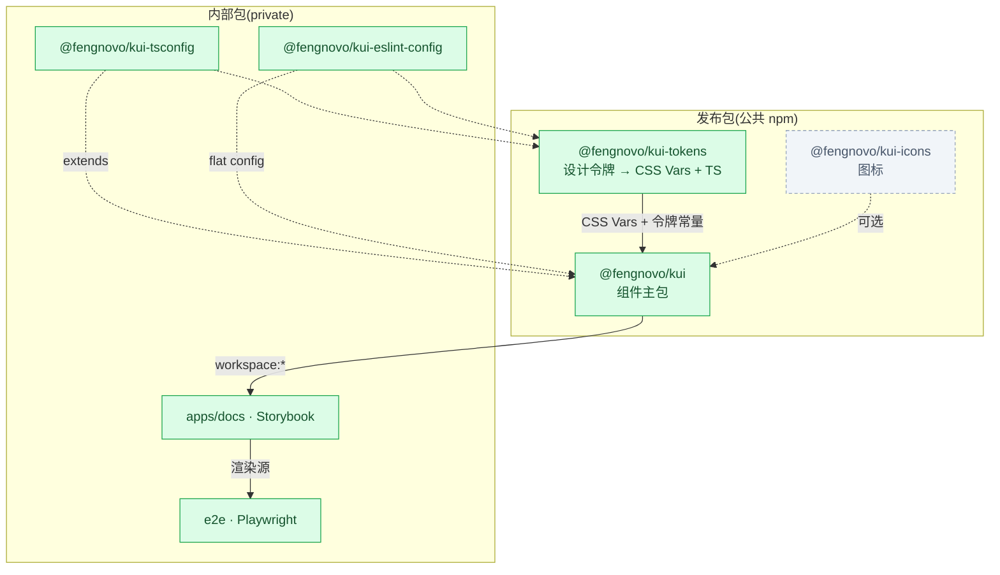
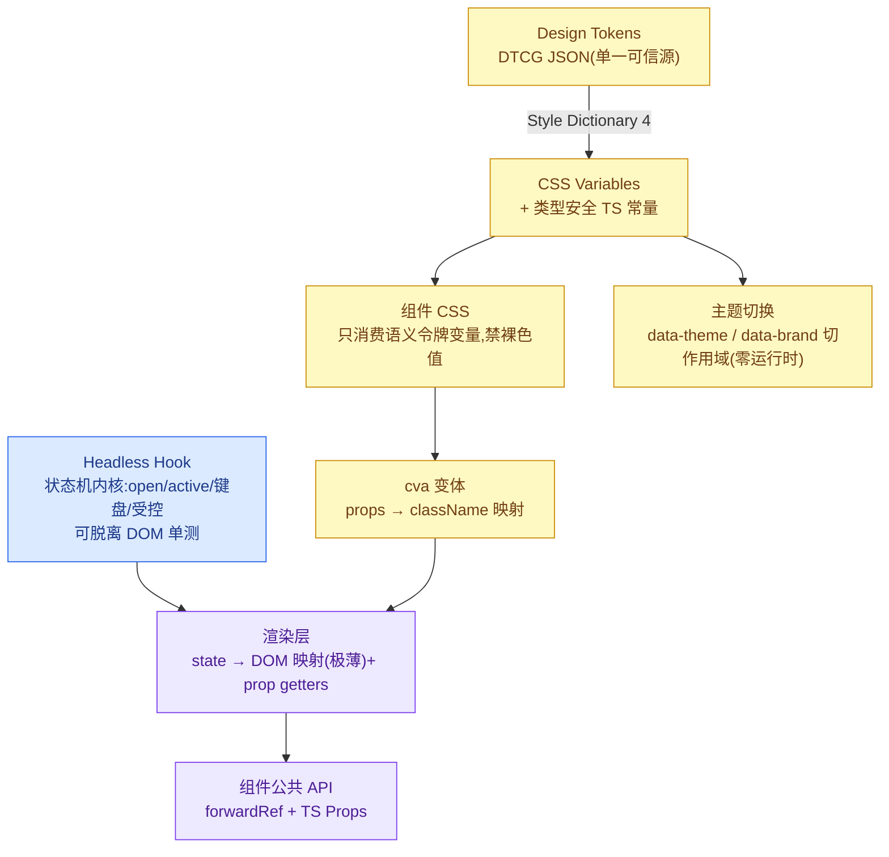
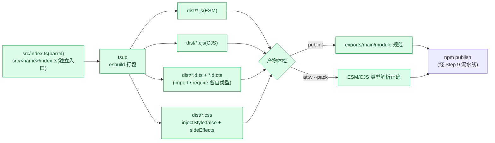
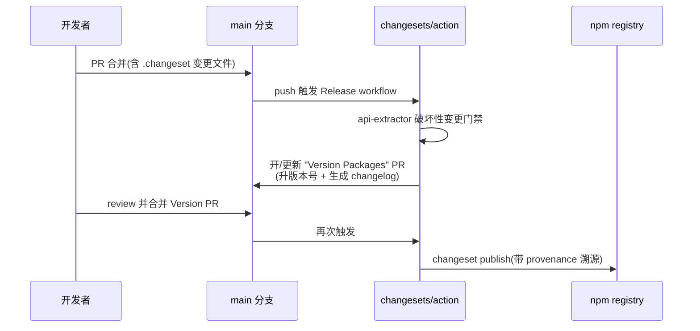

# @fengnovo/kui

> 生产级自研 React 组件库 · monorepo。唯一事实源为 [`docs/impl-guide.md`](docs/impl-guide.md)(《自研组件库实现指南》),按 Step 顺序从 0 到 1 落地。

技术栈:**pnpm + Turborepo** 编排 · **tsup**(JS)+ **api-extractor**(类型)打包 · **Design Token → CSS Variables + cva** 样式 · **自研 Headless Hook** 行为层 · **Vitest + Testing Library + axe + Playwright** 测试 · **Changesets + GitHub Actions** 发布 · **Storybook 8** 文档。

> 完整交互文档见 Storybook「快速开始」页(本地 `pnpm --filter docs storybook`);本节是其精简版。

---

## 安装与使用

```bash
# 组件主包 + 令牌底座(peerDeps:react / react-dom >= 18)
pnpm add @fengnovo/kui @fengnovo/kui-tokens
```

**引入样式(必需,两层):** 组件 CSS 只消费语义令牌变量,需同时引「令牌底座」和「组件样式」。在应用入口引一次:

```ts
import '@fengnovo/kui-tokens/vars.css';        // 令牌底座:定义 --brand-primary 等(必需)
import '@fengnovo/kui-tokens/theme-dark.css';  // 暗色变量(可选,换肤时引)
import '@fengnovo/kui/styles.css';             // 组件样式(必需)
```

**使用组件 —— 按需引入(推荐):** 每个组件有独立子路径入口,配合 `sideEffects` 配置,只打入实际引用的组件:

```tsx
import { Button } from '@fengnovo/kui/button';
import { Switch } from '@fengnovo/kui/switch';
import { Select } from '@fengnovo/kui/select';

<Button variant="solid">确定</Button>
<Switch defaultChecked aria-label="深色模式" />
```

> 也可全量引入 `import { Button, Switch } from '@fengnovo/kui'`;支持 tree-shake 的打包器同样只会打入用到的组件。

**换肤(切作用域,不改组件代码):** 在任意祖先切 `data-theme` / `data-brand`,令牌变量随之级联:

```tsx
<html data-theme="dark">…</html>      {/* 整页暗色 */}
<section data-theme="dark">…</section> {/* 仅局部暗色 */}
```

> 想新增组件,见操作手册 [`docs/adding-a-component.md`](docs/adding-a-component.md)。

---

## 包布局

npm scope 不能嵌套,故 `kui` 作包名前缀(复用个人 scope `@fengnovo`)。

| 包 | 目录 | 说明 | 发布 |
|---|---|---|---|
| `@fengnovo/kui` | `packages/kui` | 组件主包(Headless + 渲染 + 样式) | ✅ 公共 npm |
| `@fengnovo/kui-tokens` | `packages/tokens` | 设计令牌(DTCG)+ Style Dictionary 产物 | ✅ 公共 npm |
| `@fengnovo/kui-icons` | `packages/icons` | 图标(独立升版本) | ✅ 公共 npm |
| `@fengnovo/kui-tsconfig` | `packages/tsconfig` | 内部共享 tsconfig | 🔒 private |
| `@fengnovo/kui-eslint-config` | `packages/eslint-config` | 内部共享 lint | 🔒 private |
| docs | `apps/docs` | Storybook 文档站 | 🔒 private |
| e2e | `e2e` | Playwright E2E + 视觉回归 | 🔒 private |

> `@fengnovo/monitor-sdk` 是独立产品,留在它自己的仓库,仅共用 scope,不在本 repo。

---

## 整体架构

### 1. Monorepo 包依赖图

依赖方向受控、单向、禁环(后续以 `dependency-cruiser` 在 CI 校验)。



> 🟩 已落地 · ⬜ 规划中(虚线边=尚未建立的依赖)

### 2. 组件库分层架构

样式、行为、渲染三层解耦——这是自研库的核心价值:把交互/键盘/无障碍沉淀进**可独立单测**的内核。



---

## 构建与发布流程

### 3. 构建产物流水线(Step 2 · 已落地)

每个组件独立入口 → 按需 tree-shake;ESM + CJS 双格式;CSS 独立产出不内联;condition-specific types。



### 4. 单组件全链路(Button/Select 已跑通)

新组件"沿同一条轨道走":代码 → 样式 → 测试 → 文档 → 产物。

```mermaid
flowchart LR
    code["组件代码<br/>Headless Hook + 渲染层"] --> style["样式<br/>CSS Vars + cva"]
    style --> test["测试<br/>Vitest + axe(逻辑/键盘/受控/无障碍)"]
    test --> story["Story<br/>Storybook autodocs + a11y"]
    story --> visual["视觉回归<br/>Playwright 像素快照"]
    visual --> dist["产物<br/>独立入口 + 按需打包"]
    dist --> cs["Changeset<br/>变更说明"]
```

### 5. 两段式发布(Step 9 · 配置就绪)

push main 开 Version PR → 人工 review 合并 → 自动 publish。发版可审阅、可控,而非 push 即发。



---

## 当前进度

| Step | 内容 | 状态 |
|---|---|---|
| Step 1 | 工程骨架(Monorepo:pnpm + Turborepo + 共享 tsconfig/eslint) | ✅ 已落地 |
| Step 2 | 构建产物体系(tsup 双格式 + 独立入口 + publint/attw 体检) | ✅ 已落地 |
| Step 3 | 设计令牌管线(DTCG + Style Dictionary 4) | ✅ 已落地 |
| Step 4 | 样式落地(CSS Vars + cva) | ✅ 已落地 |
| Step 5 | 第一个组件垂直切片(Button)打通全链路 | ✅ 已落地(Story 归 Step 8) |
| Step 6 | 复杂组件(Select)· Headless 内核 + 无障碍 + 键盘 | ✅ 已落地 |
| Step 7 | 测试体系(单元/集成/axe/E2E/视觉回归) | ✅ 已落地 |
| Step 8 | 文档站(Storybook) | ✅ 已落地(部署留 Step 9) |
| Step 9 | 版本与发布流水线(Changesets + GitHub Actions) | ✅ 配置就绪(待基建交接) |

变更记录见 [`docs/CHANGELOG.md`](docs/CHANGELOG.md);架构决策记录见 [`docs/adr/`](docs/adr/)。

---

## 常用命令

```bash
pnpm install                              # 安装工作区依赖
pnpm build                                # turbo 增量构建全部包(二次命中 cache)
pnpm --filter @fengnovo/kui build         # 只构建主包
pnpm lint && pnpm typecheck               # ESLint 0 error + tsc strict
pnpm --filter @fengnovo/kui check:publish # 发布前产物体检(publint + attw)
```

---

## 环境

Node ≥ 18(开发用 20+)· pnpm 10 · TypeScript 5。
